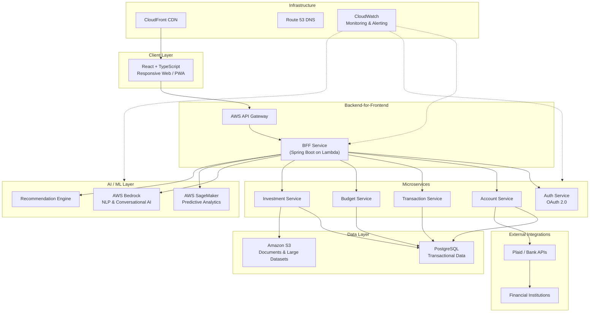
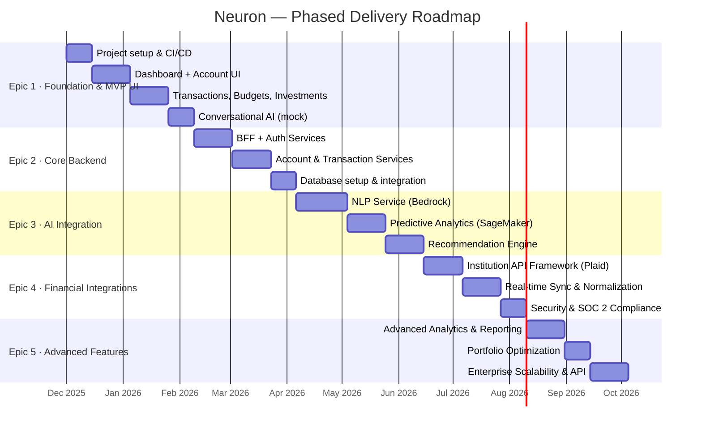
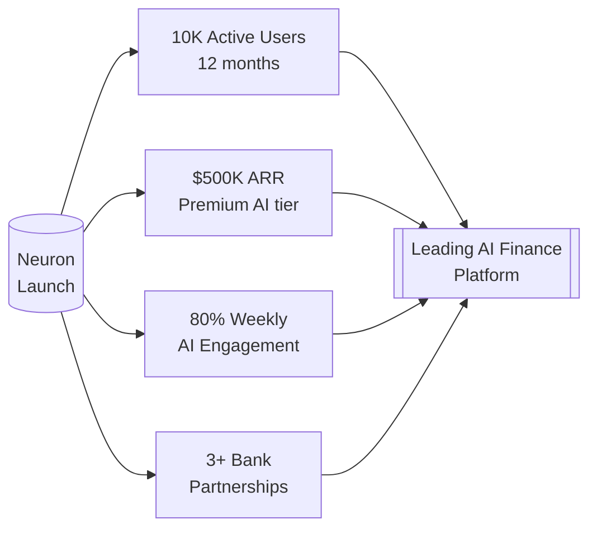

# Neuron — Product Brief

> **Version:** 1.0 · **Status:** Ready for Architecture · **Date:** February 2026

---

## Executive Summary

Neuron is an AI-powered personal finance management platform that unifies all financial accounts, transactions, investments, and budgets into a single, intelligent interface. By combining conversational AI, predictive analytics, and automated recommendations, Neuron democratizes access to sophisticated financial analysis — giving every user the experience of having a personal financial advisor in their pocket.

---

## Problem Statement

Personal finance management today is **fragmented, time-consuming, and inaccessible**. Users juggle multiple banking apps, spreadsheets, and advisor calls to get a complete picture of their finances. Sophisticated analysis tools exist but are locked behind professional fees or technical complexity. Neuron eliminates this friction by aggregating all financial data in one place and surfacing actionable intelligence through natural language.

---

## Product Vision & Goals

Neuron aims to become the **leading AI-powered personal finance platform** within 12 months of launch.

| Goal                       | Target                                                      |
| -------------------------- | ----------------------------------------------------------- |
| Active users               | 10,000 within 12 months                                     |
| Annual Recurring Revenue   | $500K+ from premium AI features                             |
| AI engagement rate         | 80% of users access AI insights weekly                      |
| Time savings               | 30% average reduction in financial management time          |
| Goal achievement           | 60% of users reach their primary financial goal in 6 months |
| AI recommendation accuracy | 70% satisfaction rate; 95%+ NLP accuracy                    |
| Institutional partnerships | 3+ major financial institutions                             |

---

## Target Audience

Personal finance users who want better visibility and control over their wealth — from everyday budgeters to active investors — regardless of financial expertise level.

---

## Core Capabilities

| #   | Capability                      | Description                                                                            |
| --- | ------------------------------- | -------------------------------------------------------------------------------------- |
| 1   | **Conversational AI**           | Natural language queries against live financial data; context-aware follow-up dialogue |
| 2   | **Predictive Analytics**        | Cash flow forecasting, investment performance projection, goal-achievement probability |
| 3   | **Intelligent Recommendations** | Budget optimization, debt payoff strategies, portfolio rebalancing alerts              |
| 4   | **Unified Dashboard**           | Aggregated view of all accounts, transactions, investments, and budgets                |
| 5   | **Smart Categorization**        | AI-powered transaction tagging and spending breakdown                                  |
| 6   | **Budget Monitoring**           | Automated alerts and progress tracking against spending limits                         |
| 7   | **Investment Analysis**         | Portfolio performance metrics, allocation views, and comparison benchmarks             |
| 8   | **Goal Tracking**               | Financial goal planning with milestone notifications and AI coaching                   |

---

## Key User Interactions

- **Chat-first interface** — ask questions in plain English, get instant answers
- **Drag-and-drop** — adjust budgets and rebalance portfolios visually
- **Swipe gestures** — quick transaction categorization on mobile
- **Voice input** — hands-free queries during commutes or multitasking
- **Progressive disclosure** — surface complexity only when the user needs it

---

## Technical Architecture

**Stack summary:**

| Layer      | Technology                                   |
| ---------- | -------------------------------------------- |
| Frontend   | React + TypeScript, PWA                      |
| BFF / API  | Java Spring Boot on AWS Lambda               |
| Database   | PostgreSQL (OLTP) + Amazon S3 (docs)         |
| AI / NLP   | AWS Bedrock + SageMaker                      |
| CDN / DNS  | CloudFront + Route 53                        |
| Auth       | OAuth 2.0                                    |
| Security   | E2E encryption, SOC 2, WCAG 2.1 AA           |
| Monitoring | AWS CloudWatch                               |
| Repo       | Monorepo (frontend + services + shared libs) |

---

## Delivery Roadmap

### Epic Summary

| Epic                           | Focus                           | Key Deliverable                                      |
| ------------------------------ | ------------------------------- | ---------------------------------------------------- |
| **1 · Foundation & MVP UI**    | Infrastructure + UX validation  | Fully interactive UI with mock data and simulated AI |
| **2 · Core Backend Services**  | BFF, microservices, databases   | Secure, scalable backend replacing mock data         |
| **3 · AI Capabilities**        | Real NLP + predictive analytics | Live conversational AI and forecasting engine        |
| **4 · Financial Integrations** | Institution connectivity        | Real account sync via Plaid / bank APIs              |
| **5 · Advanced Features**      | Analytics, optimization, scale  | Portfolio AI, enterprise scalability, public API     |

---

## Non-Functional Requirements at a Glance

| Requirement            | Target                                       |
| ---------------------- | -------------------------------------------- |
| AI query response time | < 2 seconds                                  |
| Page load time         | < 3 seconds                                  |
| System uptime          | 99.9%                                        |
| Concurrent users       | 10,000+                                      |
| NLP accuracy           | 95%+                                         |
| Accessibility          | WCAG 2.1 AA                                  |
| Platform support       | Web (responsive) + PWA (iOS 12+, Android 8+) |
| Security               | SOC 2 compliant, E2E encryption, MFA         |
| Operational budget cap | $200K / month (AI/ML services)               |

---

## Success Metrics

---

## Design Principles

1. **Trust by default** — every design decision reinforces security and reliability
2. **AI as advisor, not oracle** — recommendations are actionable but always user-controlled
3. **Progressive complexity** — powerful features surface only when the user is ready
4. **Accessibility first** — WCAG 2.1 AA compliance is non-negotiable
5. **Speed as a feature** — sub-2-second AI responses maintain conversational flow

---

## Current Status & Next Steps

The PRD has been validated at **95% completeness** and is **ready for the Architecture phase**.

| Next Step                  | Owner            | Action                                                                                    |
| -------------------------- | ---------------- | ----------------------------------------------------------------------------------------- |
| System Architecture Design | Architect        | Define AWS microservices implementation, data flows, and security architecture            |
| UX Specification           | UX Expert        | Wireframes, design system, and interaction specifications for conversational AI interface |
| Epic 1 Kickoff             | Engineering Lead | Spin up monorepo, CI/CD, and begin MVP UI build-out                                       |
