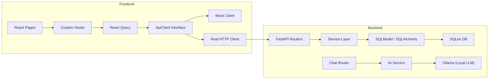

# Neuron — Codebase Walkthrough

> **AI-Powered Financial Wellness Platform**

Neuron is a full-stack personal finance application that combines traditional financial tracking (accounts, transactions, budgets, portfolio) with AI-powered conversational insights. It uses a monorepo layout with a React frontend and a Python FastAPI backend.

---

## Repository Structure

```
Neuron/
├── apps/web/             ← React frontend (Vite + TypeScript + TailwindCSS v4)
├── backend/              ← Python FastAPI backend (SQLite + Alembic)
├── docs/                 ← Documentation & bank statements
└── README.md             ← Top-level project overview
```

---

## Frontend — `apps/web/`

| Concern | Technology |
|---|---|
| Framework | React 18 + TypeScript |
| Build tool | Vite 7 |
| Styling | TailwindCSS v4 (via `@tailwindcss/postcss`) |
| State management | Zustand (global), TanStack React Query (server state) |
| Routing | React Router v7 (`createBrowserRouter`, lazy-loaded) |
| Charts | Recharts 3 |
| Icons | Lucide React |
| Utilities | `clsx`, `tailwind-merge` |
| Testing | Jest + Testing Library |

### Key Architecture Decisions

#### 1. Lazy-Loaded Router ([router.tsx](file:///Users/adityasj/Documents/Workspace/Projects/Neuron/apps/web/src/app/router.tsx))
All page components are code-split via `React.lazy()`. The `AppLayout` component renders a shared `Navigation` bar with a `<Suspense>` boundary around the `<Outlet>`.

#### 2. Pluggable API Client ([client.ts](file:///Users/adityasj/Documents/Workspace/Projects/Neuron/apps/web/src/api/client.ts))
The frontend defines an `ApiClient` interface and uses a factory pattern to switch between:
- **Mock client** (`api/mock/client.ts`) — hardcoded data for offline development
- **Real client** (`api/real/client.ts`) — makes HTTP requests to the FastAPI backend

The mode is determined by `localStorage.api_mode` or the `VITE_API_MODE` env var (defaults to `mock`).

#### 3. React Query Provider ([providers.tsx](file:///Users/adityasj/Documents/Workspace/Projects/Neuron/apps/web/src/app/providers.tsx))
Wraps the app in `QueryClientProvider` with 5-minute stale time and single retry.

#### 4. AI Service (Client-Side Stub) ([aiService.ts](file:///Users/adityasj/Documents/Workspace/Projects/Neuron/apps/web/src/services/aiService.ts))
A singleton `AIService` class that currently returns canned responses based on keyword matching. It simulates latency and categorizes queries into spending, accounts, budget, net worth, investment, and general topics. This is a stub awaiting real backend integration (via the Ollama-backed `/api/v1/chat` endpoint).

### Frontend Source Layout

```
src/
├── app/
│   ├── providers.tsx          # React Query provider
│   └── router.tsx             # createBrowserRouter config (lazy routes)
├── api/
│   ├── client.ts              # ApiClient interface + factory
│   ├── types.ts               # API response/request types
│   ├── mock/client.ts         # Mock API implementation
│   └── real/client.ts         # Real HTTP API implementation
├── components/
│   ├── features/              # Domain-specific components
│   │   ├── accounts/          # AccountCard, AccountDetailsModal
│   │   ├── chat/              # ChatInterface, MessageBubble
│   │   ├── dashboard/         # Charts, widgets, stat cards (15+ components)
│   │   ├── emergencyFund/     # EmergencyFundForm
│   │   └── transactions/      # TransactionDetailsModal, TransactionFormModal
│   ├── layout/                # Navigation, Footer, Sidebar
│   └── ui/                    # Reusable primitives (Button, Card, Modal, etc.)
├── hooks/                     # 14 custom hooks for data fetching & UI logic
├── pages/                     # 10 page components (Dashboard, Accounts, etc.)
├── services/                  # aiService (client-side AI stub)
├── stores/                    # Zustand stores (user, financial)
├── styles/                    # CSS (globals, index, themes)
├── types/                     # TypeScript type definitions
└── utils/                     # Constants, CSV parsing, account balance calcs
```

### Pages & Routes

| Route | Page Component | Description |
|---|---|---|
| `/` | [Dashboard](file:///Users/adityasj/Documents/Workspace/Projects/Neuron/apps/web/src/pages/Dashboard.tsx) | Financial overview with charts, stats, alerts |
| `/accounts` | [Accounts](file:///Users/adityasj/Documents/Workspace/Projects/Neuron/apps/web/src/pages/Accounts.tsx) | Account management with detail modals |
| `/transactions` | [Transactions](file:///Users/adityasj/Documents/Workspace/Projects/Neuron/apps/web/src/pages/Transactions.tsx) | Transaction list with filtering, selection, CRUD |
| `/portfolio` | [Portfolio](file:///Users/adityasj/Documents/Workspace/Projects/Neuron/apps/web/src/pages/Portfolio.tsx) | Investment/stock holdings tracker |
| `/budget` | [Budget](file:///Users/adityasj/Documents/Workspace/Projects/Neuron/apps/web/src/pages/Budget.tsx) | Budget creation and tracking |
| `/reports` | [Reports](file:///Users/adityasj/Documents/Workspace/Projects/Neuron/apps/web/src/pages/Reports.tsx) | Financial reports |
| `/imports` | [Imports](file:///Users/adityasj/Documents/Workspace/Projects/Neuron/apps/web/src/pages/Imports.tsx) | CSV file import with column mapping |
| `/chat` | [Chat](file:///Users/adityasj/Documents/Workspace/Projects/Neuron/apps/web/src/pages/Chat.tsx) | AI financial assistant |
| `/settings` | [Settings](file:///Users/adityasj/Documents/Workspace/Projects/Neuron/apps/web/src/pages/Settings.tsx) | User preferences |

---

## Backend — `backend/`

| Concern | Technology |
|---|---|
| Framework | FastAPI 0.104 |
| ORM | SQLModel 0.0.14 (SQLAlchemy 2.0 + Pydantic) |
| Database | SQLite (async via `aiosqlite`) |
| Migrations | Alembic 1.12 (auto-run on startup) |
| Config | Pydantic Settings (`.env` file) |
| AI Integration | Ollama (local LLM, via `httpx`) |
| Testing | pytest + pytest-asyncio + Hypothesis |

### Backend Architecture

```
backend/
├── app/
│   ├── main.py                # FastAPI app creation, lifespan, middleware
│   ├── config.py              # Pydantic Settings (env-driven)
│   ├── database.py            # Async SQLAlchemy engine + session factory
│   ├── dependencies.py        # DI: get_session(), get_user_id()
│   ├── models/                # SQLModel ORM models (5 tables)
│   │   ├── account.py         # Account + nested detail/metric models
│   │   ├── transaction.py     # Transaction
│   │   ├── budget.py          # Budget
│   │   ├── stock_holding.py   # StockHolding
│   │   └── import_history.py  # ImportHistory
│   ├── schemas/               # Pydantic request/response schemas
│   │   ├── account.py         # Create/Update/Response schemas
│   │   ├── transaction.py
│   │   ├── budget.py
│   │   ├── stock_holding.py
│   │   ├── dashboard.py
│   │   ├── chat.py
│   │   ├── import_history.py
│   │   └── common.py          # SuccessResponse wrapper
│   ├── routers/               # API route handlers (8 routers)
│   │   ├── health.py
│   │   ├── accounts.py
│   │   ├── transactions.py
│   │   ├── budgets.py
│   │   ├── portfolio.py
│   │   ├── dashboard.py
│   │   ├── imports.py
│   │   └── chat.py
│   ├── services/              # Business logic layer (7 services)
│   │   ├── account_service.py
│   │   ├── transaction_service.py
│   │   ├── budget_service.py
│   │   ├── portfolio_service.py
│   │   ├── dashboard_service.py
│   │   ├── import_service.py
│   │   └── ai_service.py
│   ├── middleware/             # Error handling middleware
│   └── utils/                 # Constants, exceptions, validators
├── alembic/                   # Database migrations (2 versions)
├── tests/                     # Test suite (7 test modules + conftest)
└── scripts/                   # Utility scripts
```

### Key Design Patterns

#### 1. Application Lifecycle ([main.py](file:///Users/adityasj/Documents/Workspace/Projects/Neuron/backend/app/main.py))
- Uses FastAPI's `lifespan` context manager for startup/shutdown
- Runs Alembic migrations synchronously on startup
- A middleware blocks `/api/v1/` endpoints if migrations are pending

#### 2. Dependency Injection ([dependencies.py](file:///Users/adityasj/Documents/Workspace/Projects/Neuron/backend/app/dependencies.py))
- `get_session()` — async generator yielding an `AsyncSession`
- `get_user_id()` — returns `DEFAULT_USER_ID` from settings (single-user stub; no auth yet)

#### 3. Service Layer Pattern
Business logic is encapsulated in service classes (e.g., [DashboardService](file:///Users/adityasj/Documents/Workspace/Projects/Neuron/backend/app/services/dashboard_service.py)). Routers delegate to services, keeping route handlers thin.

#### 4. Account Model with JSON Columns ([account.py](file:///Users/adityasj/Documents/Workspace/Projects/Neuron/backend/app/models/account.py))
The `Account` model uses JSON columns for type-specific nested details (loan, property, savings, checking, trading, property metrics). This avoids table-per-type inheritance while allowing rich structured data.

#### 5. Error Handling
Custom exception classes (`NeuronException`, `ResourceNotFoundError`, `ValidationError`) with registered FastAPI exception handlers.

### API Endpoints Summary

| Domain | Prefix | Operations |
|---|---|---|
| Health | `/health` | `GET` |
| Accounts | `/api/v1/accounts` | CRUD + cascade delete |
| Transactions | `/api/v1/transactions` | CRUD + bulk create/delete + filtering |
| Budgets | `/api/v1/budgets` | List + Create |
| Portfolio | `/api/v1/portfolio` | Holdings list + Stats |
| Dashboard | `/api/v1/dashboard` | Aggregated stats |
| Imports | `/api/v1/imports` | CSV upload + history |
| Chat | `/api/v1/chat` | AI message (Ollama) |

### Environment Configuration ([config.py](file:///Users/adityasj/Documents/Workspace/Projects/Neuron/backend/app/config.py))

| Variable | Default | Purpose |
|---|---|---|
| `DATABASE_URL` | `sqlite+aiosqlite:///./neuron.db` | Database connection |
| `OLLAMA_BASE_URL` | `http://localhost:11434` | Local LLM for chat |
| `CORS_ORIGINS` | `http://localhost:5173,http://localhost:3000` | Allowed origins |
| `DEFAULT_USER_ID` | `user-1` | Single-user auth stub |
| `ENVIRONMENT` | `development` | App environment |

---

## Data Flow



---

## Developer Workflows

### Running the Frontend
```bash
cd apps/web
npm install
npm run dev          # → http://localhost:5173
```

### Running the Backend
```bash
cd backend
python -m venv venv && source venv/bin/activate
pip install -r requirements.txt
python -m uvicorn app.main:app --reload   # → http://localhost:8000
```

### Switching API Modes (Frontend)
- Set `VITE_API_MODE=real` in `apps/web/.env` to use the live backend
- Or set `localStorage.api_mode = 'real'` in the browser console
- Defaults to `mock` (no backend needed)

### Running Tests
```bash
# Backend
cd backend && pytest -v

# Frontend
cd apps/web && npm test
```

### Database Migrations
```bash
cd backend
alembic revision --autogenerate -m "description"   # Create migration
alembic upgrade head                                # Apply (also auto-runs on startup)
```

---

## Notable Observations

> [!NOTE]
> The frontend has **two routing setups**: [App.tsx](file:///Users/adityasj/Documents/Workspace/Projects/Neuron/apps/web/src/App.tsx) uses `<BrowserRouter>` while [main.tsx](file:///Users/adityasj/Documents/Workspace/Projects/Neuron/apps/web/src/main.tsx) uses `<RouterProvider>` with `createBrowserRouter`. The `main.tsx` version (with lazy loading) is the active entrypoint — `App.tsx` appears to be a legacy file.

> [!NOTE]
> There is a `Transactions.tsx.backup` file in the pages directory — likely a pre-refactor snapshot.

> [!NOTE]
> The AI chat feature has **dual implementations**: a client-side stub in [aiService.ts](file:///Users/adityasj/Documents/Workspace/Projects/Neuron/apps/web/src/services/aiService.ts) (hardcoded responses) and a backend endpoint (`/api/v1/chat`) backed by Ollama. The frontend Chat page and the backend chat router exist but full integration depends on API mode.

> [!IMPORTANT]
> Authentication is **not implemented**. The backend uses a hardcoded `DEFAULT_USER_ID = "user-1"` for all requests. The frontend types include `LoginRequest`/`LoginResponse` schemas but no auth flow exists.
